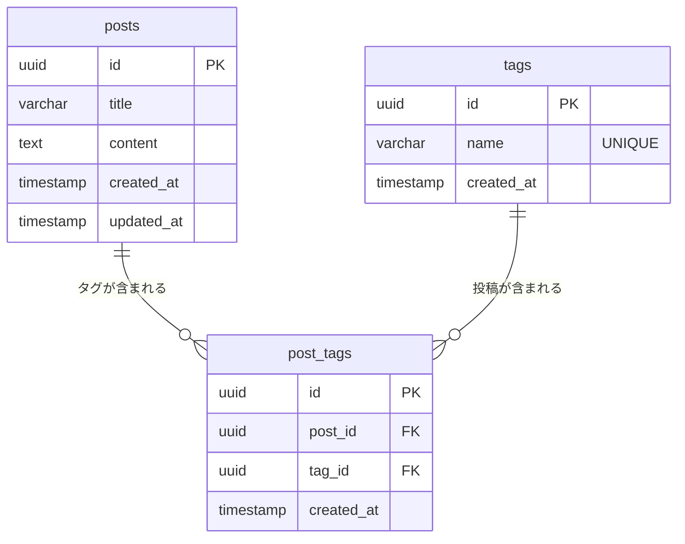

# 課題名

データベース設計のアンチパターン１
課題２

# 課題

課題１の問題点を解決するよう、スキーマ設計を変更する

# 結論

```mermaid
erDiagram
    posts {
        uuid      id          PK
        varchar   title
        text      content
        timestamp created_at
        timestamp updated_at
    }

    tags {
        uuid      id          PK
        varchar   name        "UNIQUE"
        timestamp created_at
    }

    post_tags {
        uuid      id          PK          ""
        uuid      post_id     FK          ""
        uuid      tag_id      FK          ""
        timestamp created_at
    }

    posts     ||--o{ post_tags : "タグが含まれる"
    tags      ||--o{ post_tags : "投稿が含まれる"


```

- post_tagsでは、UNIQUE (post_id, tag_id) で同じタグを同じ記事に二重登録させない
