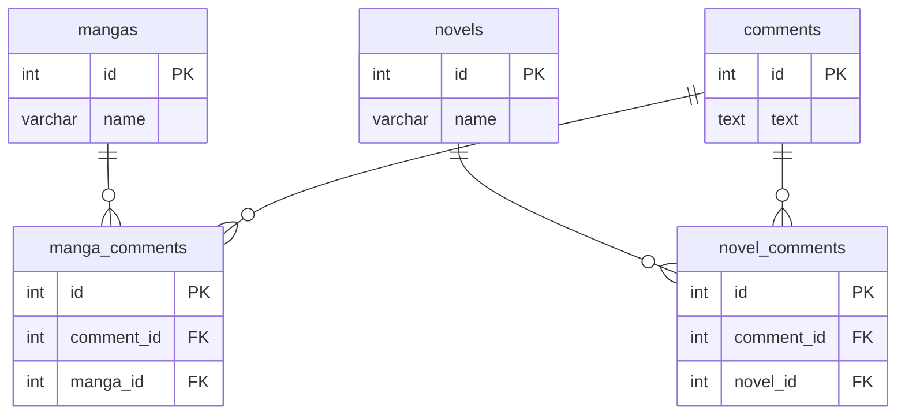

# 課題名

データベース設計のアンチパターン3
課題2

# 課題

```
どのようにテーブル設計を見直せば課題1の問題は解決できるでしょうか？
新しいスキーマを描いてみてください。
```

# 結論


```mermaid
erDiagram
    mangas {
        int    id PK
        varchar name
    }
    novels {
        int    id PK
        varchar name
    }
    comments {
        int    id PK
        text   text
    }
    manga_comments {
        int id PK
        int comment_id FK
        int manga_id   FK
    }
    novel_comments {
        int id PK
        int comment_id FK
        int novel_id   FK
    }

    mangas       ||--o{ manga_comments : ""
    comments     ||--o{ manga_comments : ""
    novels       ||--o{ novel_comments : ""
    comments     ||--o{ novel_comments : ""

```
