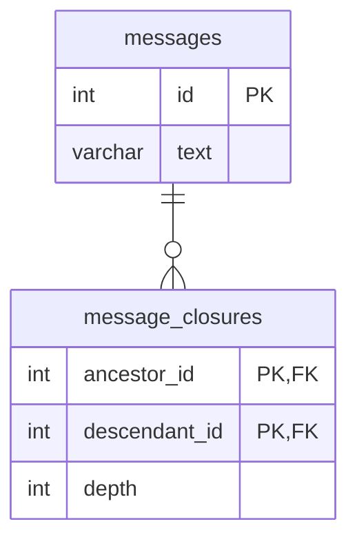

# 課題名

データベース設計のアンチパターン4
課題2

# 課題

```
どのようにテーブル設計を見直せば課題1の問題は解決できるでしょうか？
新しいスキーマを考えて、UML図を描いてみてください。
```

# 結論


```mermaid
erDiagram

    messages {
        int id PK
        varchar text
    }


    message_closures {
        int ancestor_id PK,FK ""
        int descendant_id PK,FK ""
        int depth
    }

    messages ||--o{ message_closures : ""

```
