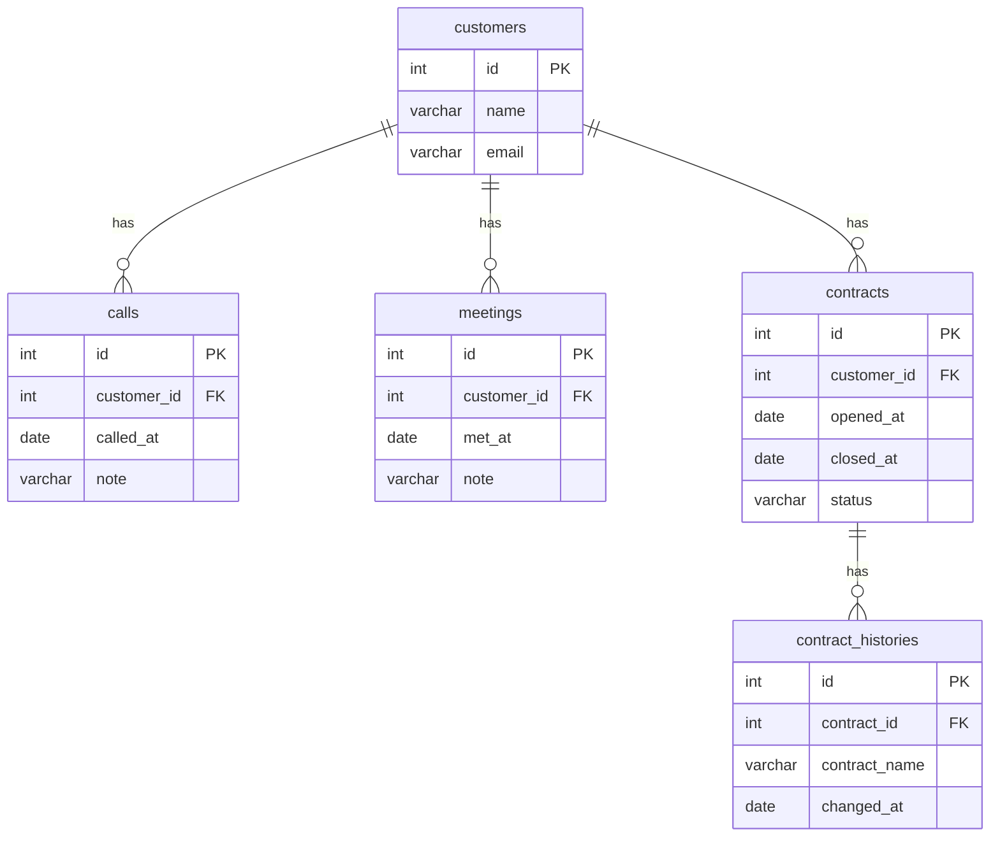

# 課題名

データベース設計のアンチパターン5
課題2

# 課題

```
どのようにテーブル設計を見直せば課題1の問題は解決できるでしょうか？
新しいスキーマを考えて、UML図を描いてみてください。
```

# 結論


```mermaid

erDiagram
    customers {
        int id PK ""
        varchar name ""
        varchar email ""
    }

    calls {
        int id PK ""
        int customer_id FK ""
        date called_at ""
        varchar note ""
    }

    meetings {
        int id PK ""
        int customer_id FK ""
        date met_at ""
        varchar note ""
    }

    contracts {
        int id PK ""
        int customer_id FK ""
        date opened_at ""
        date closed_at ""
        varchar status ""
    }

    contract_histories {
        int id PK ""
        int contract_id FK ""
        varchar contract_name ""
        date changed_at ""
    }

    customers ||--o{ calls               : has
    customers ||--o{ meetings            : has
    customers ||--o{ contracts       : has
    contracts ||--o{ contract_histories : has

```
