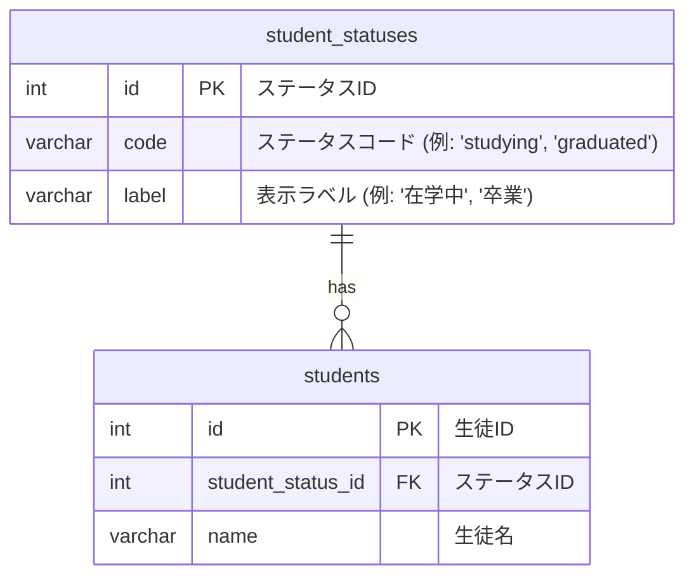

# 課題

データベース設計のアンチパターン6
課題1

# 結論

```mermaid
erDiagram
    student_statuses {
        int     id         PK   "ステータスID"
        varchar code         "ステータスコード (例: 'studying', 'graduated')"
        varchar label        "表示ラベル (例: '在学中', '卒業')"
    }

    students {
        int     id     PK    "生徒ID"
        int     student_status_id  FK  "ステータスID"
        varchar name        "生徒名"
    }

    student_statuses ||--o{ students : has

```

