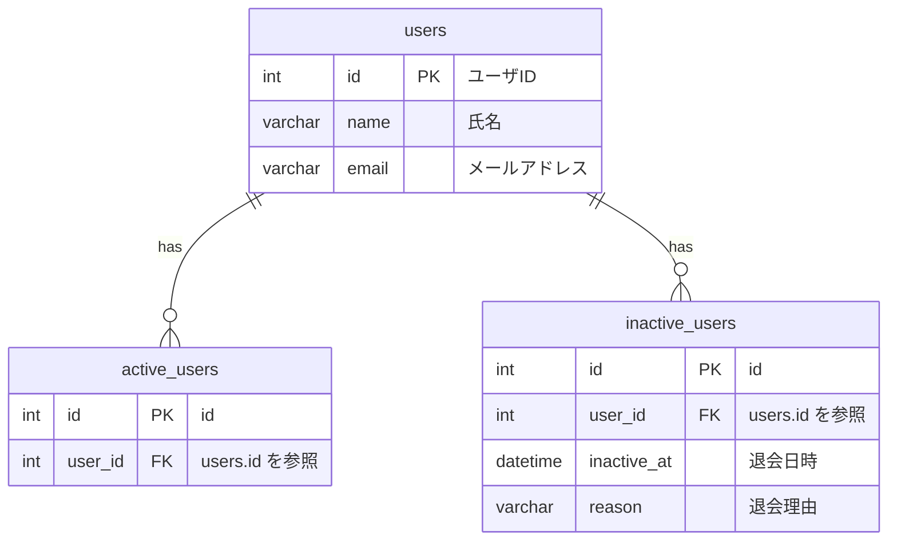

# 課題

データベース設計のアンチパターン7
課題2

# 結論

```mermaid
erDiagram
    users {
        int      id        PK   "ユーザID"
        varchar  name          "氏名"
        varchar  email         "メールアドレス"
    }

    active_users {
        int      id        PK      "id"
        int      user_id   FK      "users.id を参照"
    }

    inactive_users {
        int      id            PK      "id"
        int      user_id       FK      "users.id を参照"
        datetime inactive_at          "退会日時"
        varchar  reason              "退会理由"
    }

    users ||--o{ active_users     : "has"
    users ||--o{ inactive_users  : "has"


```
