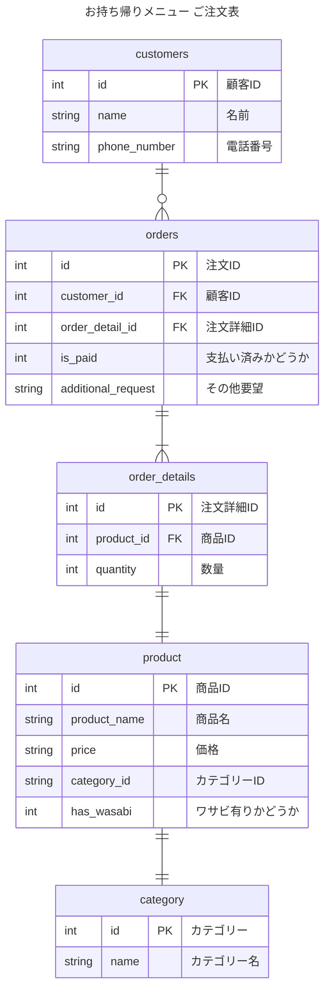

## エンティティの抽出
- 注文票
    - 顧客
        - 名前
        - 電話番号
    - 注文（複数）
        - 商品
            - 商品名
            - 価格
            - カテゴリー
                - カテゴリー名 （セットメニューの名前、もしくは「お好みすし」）
            - わさび抜きかどうか
        - 数量
    - 支払い済みかどうか
    - その他要望

## ER図
論理モデルの設計
- 顧客 1-多 注文票
- 注文票 1 - 多 注文詳細
- 注文詳細 1 - 1 商品
- 商品 1 - 1 カテゴリー

