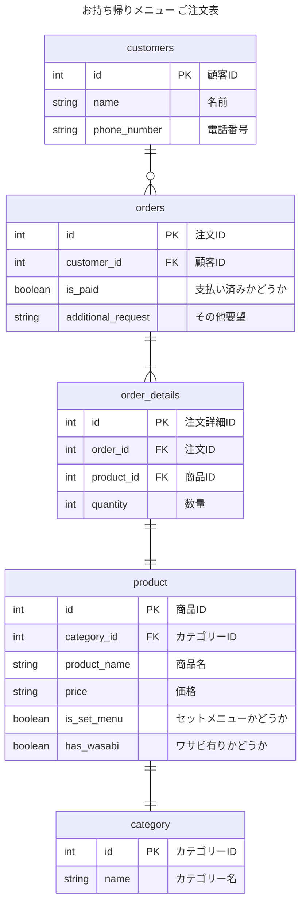

# 1-1
## 課題名
データベースモデリング１の課題１
## PRの目的
課題１の論理設計した内容に対してレビューして頂きたいです。

## 結論

### エンティティの抽出
- 注文票
    - 顧客
        - 名前
        - 電話番号
    - 注文（複数）
        - 商品
            - 商品名
            - 価格
            - カテゴリー
                - カテゴリー名 （セットメニューの名前）
            - セットメニューかどうか
            - わさび抜きかどうか
        - 数量
    - 支払い済みかどうか
    - その他要望

### ER図
論理モデルの設計
- 顧客 1-多 注文票
- 注文票 1 - 多 注文詳細
- 注文詳細 1 - 1 商品
- 商品 1 - 1 カテゴリー

## 考えたこと

- エンティティの抽出 → ER図作成という流れで行いました

- セットメニューかどうかの真偽値をproductに持たせました
    -  「お好みすし」 or 「セットメニュー名」というカテゴリーさえ用意しておけば現状のメニューの仕様は満たせそうですが、この今後カテゴリーが「お好み寿司」の中で「白身」など出てくることを考えると、別で持たせた方が良さそうと思い、セットメニューかどうかの真偽値は入れました。
        - よって、カテゴリーは、現状「盛り込み」などのセットメニューの名前になります。現状、「お好み寿司」内はカテゴリーがない想定です
- わさび有り無しは真偽値でproductに持たせて、別商品として扱っています

## メンバーに確認・相談したい内容
- この課題を解くにあたって、何から取り組むのが良いのか（何を定義するのが良いのか）
- あまり意識せずに全てのテーブルに人工的なキー（サロゲートキー）のidを作っていたけど、自然なキー（ナチュラルキー）の方が良いケースもある？

