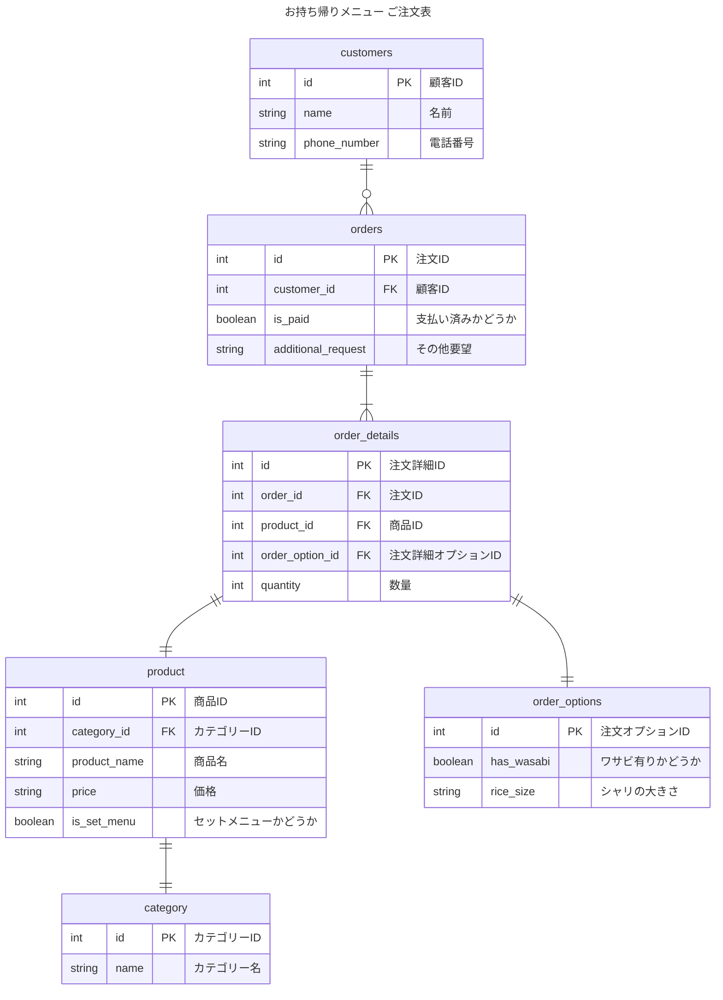
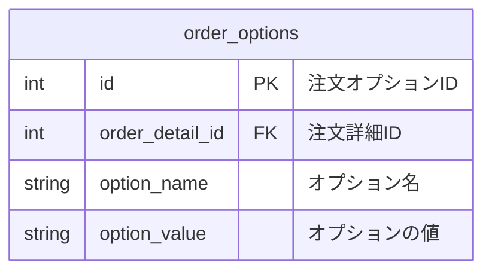

# 2-1
## 課題名
データベースモデリング１の課題2
> 今後はわさびの有無のみならずシャリの大小も選べるようになりました。どのようにテーブル設計をするべきでしょうか？

## PRの目的
課題2-1の論理設計した内容に対してレビューして頂きたいです。

## 結論

### エンティティの抽出
- 注文票
    - 顧客
        - 名前
        - 電話番号
    - 注文（複数）
        - 商品
            - 商品名
            - 価格
            - カテゴリー
                - カテゴリー名 （セットメニューの名前）
            - セットメニューかどうか
        - 注文オプション
            - わさび抜きかどうか
            - シャリが大きいか小さいか
        - 数量
    - 支払い済みかどうか
    - その他要望

### ER図
論理モデルの設計
- 顧客 1-多 注文票
- 注文票 1 - 多 注文詳細
- 注文詳細 1 - 1 商品
- 注文詳細 1 - 1 注文オプション
- 商品 1 - 1 カテゴリー

## 考えたこと
当初、以下のようなorder_optionsテーブルを作成し、レコード内にワサビ有り無し、シャリの大きさ等を入れようとしたのですが、[EAV](https://zenn.dev/kingdom0927/articles/0c1d4483409db4)というアンチパターンになりそうなので、一旦避けました。ただ、意図して採用するケースもあるそうです。

