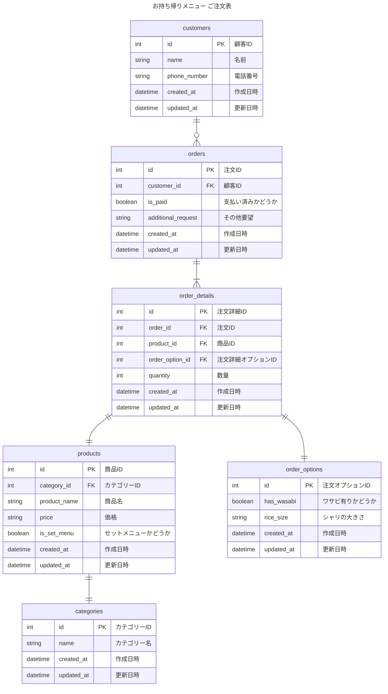

# 2-2
## 課題名
データベースモデリング１の課題2-2
> 人気の寿司ネタを特定したいので、「はな」「わだつみ」などのセット商品の売り上げとは別に、寿司ネタが毎月何個売れているのか知る必要が生じました。どのようにテーブル設計をするべきでしょうか？

## PRの目的
課題2-2の論理設計した内容に対してレビューして頂きたいです。

## 結論
基本、課題2-1と同じ論理設計だが、`created_at`, `updated_at` を追加。
課題1で既に、productsテーブルにセットメニューかどうかの `is_set_menu` のBoolean値を入れているため、`created_at` と `is_set_menu` で絞り込む想定。

### ER図

