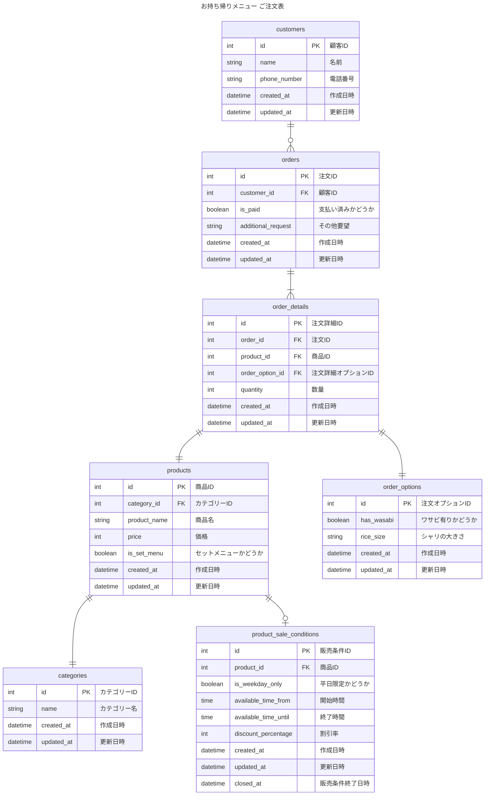

# 2-3
## 課題名
データベースモデリング１の課題2-3
下記３つの追加仕様とする。
> 平日の16時まで限定で注文可能なセットメニューが追加される

> お好みすしの中で、「白身」「赤身」「軍艦」「巻物」のカテゴリー分けで表示ができる

> お好み寿司のみ18:00以降10%オフ

## PRの目的
課題2-3の論理設計した内容に対してレビューして頂きたいです。

## 結論

### ユースケース
上記３つの追加仕様含めて改めてユースケースをまとめています
- 顧客が注文したものが登録される
- 事業者が顧客の注文を集計し、確認できる
    - 売上が確認できる
    - 寿司ネタが毎月何個売れているのか知る
- 事業者がメニューを登録できる
    - 販売時間、割引率などの販売条件のオプションを登録できる
    - 販売者（管理者側）で簡単に登録できるようなサービスがある or これから作られることも考える
- 事業者がメニューを表示できる

### エンティティの抽出
- 注文票
    - 顧客
        - 名前
        - 電話番号
    - 注文（複数）
        - 商品
            - 商品名
            - 価格
            - カテゴリー
                - カテゴリー名 （セットメニューの名前）
            - セットメニューかどうか
            - 商品販売条件オプション
                - 販売可能日時
                - 販売終了日時
                - 平日限定かどうか
                - 割引率
        - 注文オプション
            - わさび抜きかどうか
            - シャリが大きいか小さいか
        - 注文
        - 数量
    - 支払い済みかどうか
    - その他要望

### ER図
論理モデルの設計
- 顧客 1-多 注文票
- 注文票 1 - 多 注文詳細
- 注文詳細 1 - 1 商品
- 注文詳細 1 - 1 注文オプション
- 商品 1 - 1 カテゴリー
- 商品 1 - 多 商品販売条件オプション

## 考えたこと
- 右記の要件 > 平日の16時まで限定で注文可能なセットメニューが追加される
    - 販売条件テーブル（`product_sale_conditions`）を作成
        - 商品（`products`）とテーブルを分けた理由
            - 販売条件がこれからも追加されること考え、条件が増減する際にproductテーブルの変更を避けるため
        - 販売条件終了日時
            - 特定の販売終了条件が終了した際に更新する
            - データ分析用の履歴として以前の販売条件を持っておく
    - 他に考えたこと
        - 休日に祝日も含まれそうなため、DBで祝日を持つか、アプリケーション側で判定するか
            - アプリケーション側でロジックを持つオーバーヘッドが気になるなら、DB側で持つのも選択肢としてある？

- 右記の要件 > お好みすしの中で、「白身」「赤身」「軍艦」「巻物」のカテゴリー分けで表示ができる
    - 既にカテゴリーテーブルで分けられるため変更なし

- 右記の要件 > お好み寿司のみ18:00以降10%オフ
    - 販売条件テーブルに `discount_percentage` を追加
        - available_time_from: 18:00、available_time_until: 23:00（仮の終了時間）、discount_percentage: 10 のレコードをいれることで実現できる
    - 他に考えたこと
        - 販売条件が1商品で複数あるときに、競合する可能性があるため、バックエンド側で適切なバリデーションを持たせる必要がありそう。