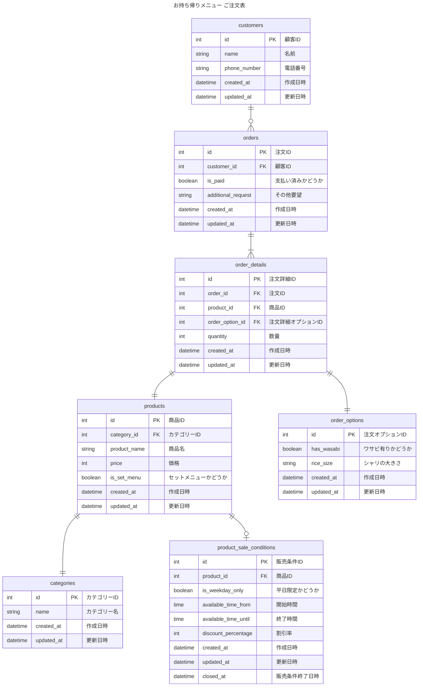

# 3
## 課題名
データベースモデリング１の課題3
以下を作成
- 設計したテーブルのDDL
- サンプルデータを投入するDML
- ユースケースを想定したクエリ

## PRの目的
課題3のレビューを頂ければと思います。

## 結論
設計は課題2-3の時と変わっておりません。
- 設計したテーブルのDDL
    - ./init.sql
- サンプルデータを投入するDML
    - ./init_data.sql
- ユースケースを想定したクエリ
    - ./sample.sql

### 参考 ER図

## 考えたこと
- docker コンテナ立ち上げ時にテーブル作成、初期データ投入をできるようにしました
- サンプルクエリは実際に課題2-3のユースケースでの想定される以下のクエリを書きました
    - 各月の寿司ネタごとの販売数を確認する
    - 全メニューを表示する
    - 顧客の新しい注文を登録する
