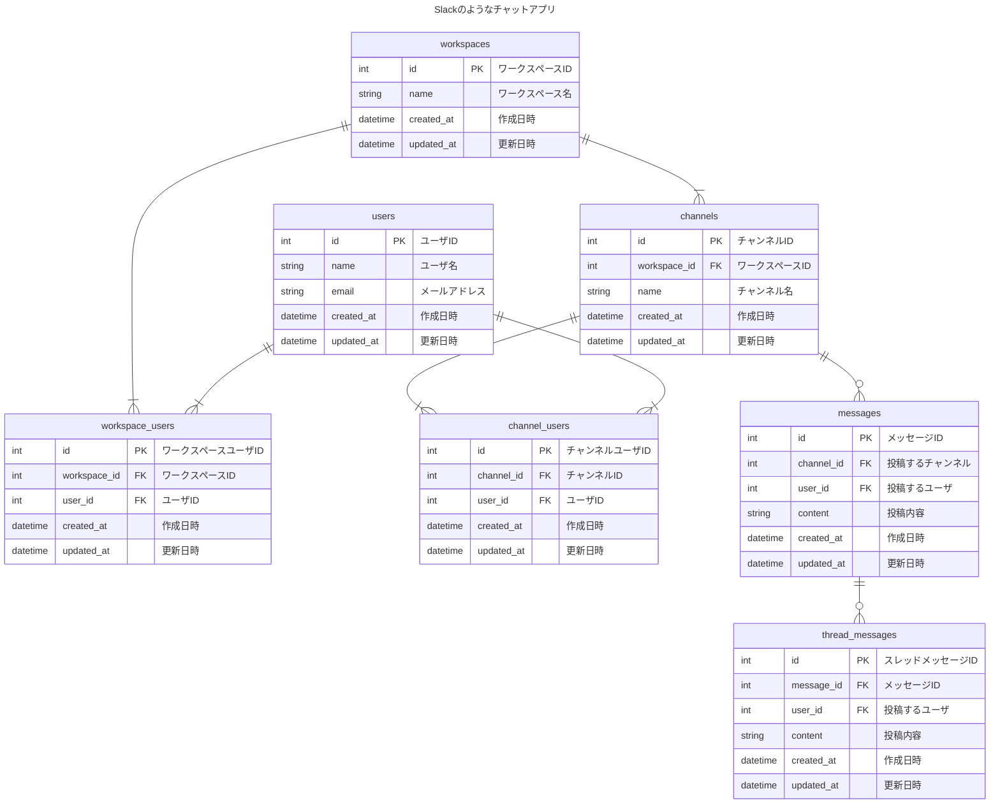

# 課題名
データベースモデリング２
# PRの目的
データベースモデリング２の以下作成しました。レビュー頂ければと思います。
- エンティティの抽出
- ER図

## ユースケース（課題の仕様から引用）
- メッセージ
    - 誰が、どのチャネルに、いつ、どんな内容を投稿したのか分かること
- スレッドメッセージ
    - 誰が、どのメッセージに、いつ、どんな内容をスレッドとして投稿したのか分かること
- チャネル
    - そのチャネルに所属しているユーザにしか、メッセージ・スレッドメッセージが見えないこと
- ユーザ
    - ワークスペースに参加・脱退できること
    - チャネルに参加・脱退できること
- 横断機能
    - メッセージとスレッドメッセージを横断的に検索できること（例えば「hoge」と検索したら、この文字列を含むメッセージとスレッドメッセージを両方とも取得できること）
    - 参加していないチャネルのメッセージ・スレッドメッセージは検索できないこと

## 結論
### エンティティの抽出
- ワークスペース（複数）
    - ユーザ（複数）
        - 名前
        - メールアドレス
    - チャネル（複数）
        - ユーザ（複数）
        - メッセージ（複数）
            - 投稿するチャネル
            - 投稿したユーザ
            - 投稿内容
            - 投稿日時
            - スレッドメッセージ（複数）
                - 親のメッセージ
                - 投稿したユーザ
                - 投稿内容
                - 投稿日時

### ER図
論理モデルの設計
- ワークスペース 多-多 ユーザ
- ワークスペース 1-多 チャネル
- チャネル 多-多 ユーザ
- チャネル 1-多 メッセージ
- ユーザ 1-多 メッセージ
- メッセージ 1-多 スレッドメッセージ

## 考えたこと
- ワークスペースとユーザ間、チャネルとユーザ間において多対多の関係ができたため、中間テーブルを作成しています。
- 履歴管理をどう設計するかで悩んでいます

## 懸念点
- ユースケースの横断検索機能でメッセージとスレッドメッセージどちらもアクセスし、検索するのでパフォーマンス等の懸念がないか

## メンバーに確認・相談したい内容
- 中間テーブルの命名
    - ２つのテーブル名を取る命名にしましたが、ほかに何か良さそうな命名をご存知であればお伺いしたいです。
