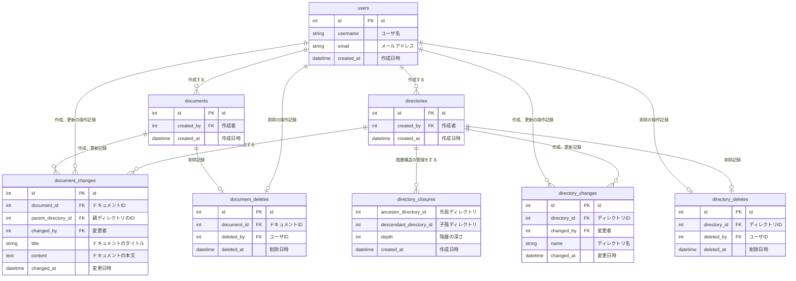

# 課題名

データベースモデリング3

# PRの目的

データベースモデリング3の以下作成しました。

- エンティティの抽出
- 物理設計

# ユースケース（課題の仕様から引用）

[Confluence](https://www.atlassian.com/ja/software/confluence) や [esa](https://esa.io/) や [Kibela](https://kibe.la/) のようなドキュメント管理システムのデータベースを設計してスケッチを作成してください。

以下の機能を備えているものとします

- ドキュメント
  - いつ、誰が、どんなテキスト情報を保存したのか管理する
  - ドキュメントは必ず何らかのディレクトリに属する
- ディレクトリ
  - 一つ以上のドキュメントを含む階層構造
  - ディレクトリは無制限にサブディレクトリを持つことができる
  - ディレクトリ構造は柔軟に変更可能。ディレクトリが移動してサブディレクトリになることもあり得る
- ユーザ
  - ドキュメントをCRUD（作成、参照、更新、削除）できる
  - ディレクトリをCRUDできる

# 結論

## ER図

## 考えたこと

論理設計

- 閉包テーブル（Closure Table） を採用しました
  - 議事録にもあった記事を参考にさせて頂きました
  - depth（深さ）は、ドキュメントとディレクトリの間の1対多の関係を明示的に表現 ＆ ディレクトリ直下のドキュメント取得をシンプルにするために設計しています
- 履歴管理もできるようにし、イミュータブルデータモデリングに沿った形で設計してみました
  - 悩んだ点
    - ドキュメントの操作イベントに対して、テーブルを作成、編集、削除等すべて分けたイベントテーブルを作るべきか悩みました
      - 今回では、作成更新含む変更イベント、削除イベントとして分けています
    - 削除する場合、document_deletesに削除イベントを書き込むことになるのですが、リソース（documents）の物理削除ができないため、[イミュータブルデータモデル](https://scrapbox.io/kawasima/%E3%82%A4%E3%83%9F%E3%83%A5%E3%83%BC%E3%82%BF%E3%83%96%E3%83%AB%E3%83%87%E3%83%BC%E3%82%BF%E3%83%A2%E3%83%87%E3%83%AB)の「リソースの削除」の項目のようにドキュメントを削除済み or 存在する でテーブルを分けるべきか悩みました
  - 参考記事
    - [イミュータブルデータモデル](https://scrapbox.io/kawasima/%E3%82%A4%E3%83%9F%E3%83%A5%E3%83%BC%E3%82%BF%E3%83%96%E3%83%AB%E3%83%87%E3%83%BC%E3%82%BF%E3%83%A2%E3%83%87%E3%83%AB)
    - [イミュータブルデータモデル(入門編)](https://www.slideshare.net/slideshow/ss-40471672/40471672)
    - [イミュータブルデータモデル(世代編)](https://www.slideshare.net/slideshow/ss-44958468/44958468)

物理設計

- 「最新の変更」を取得するクエリ（各ドキュメントの最新バージョンを取得する処理）が頻繁にありそうなので、複合インデックスを貼っています
-

## 懸念点

- イミュータブルデータモデリングかなり手探りで行ったので、何かあればご指摘頂きたいです。
