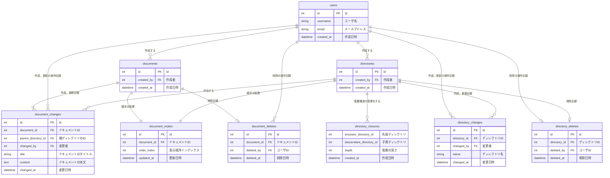

# 課題名

データベースモデリング3 課題２

# PRの目的

データベースモデリング3の課題2の仕様に基づき修正しました。

# 課題

もし上記のシステムに以下のような仕様が追加された場合、どのようなテーブル設計にしますか？

- ディレクトリ内のドキュメントの順番を変更できる
- 順番はユーザー間で共有される（例えばAさんがディレクトリ内で`hoge.txt`の前に`fuga.txt`が表示されるように並べ替えたら、Bさんがディレクトリを開いた時に`fuga.txt`が先に表示される）

# 結論

- ドキュメントの順番を記録する `document_orders` テーブルを追加

## ER図

## 考えたこと

- ディレクトリ内のドキュメントの順番を記録する `document_orders` テーブルを追加しました
  - 順序に関して特に記録を持つ必要ないと思うため、更新はOKとしています（`updated_at` を持っています）
  - テーブルを分けた理由
    - `document_changes`に並び順を保持するパターンも考えたのですが、変更履歴と並び順という関心ごとの違いや、ユーザ操作が独立して違う（ドキュメント内容変更すること、並び順を変更すること）ことで更新と頻度も違うと思うためテーブルを分けました
      - 以前のMTGから参考にさせて頂いた記事の 5番目の方法と同じだと思います。
        - <https://zenn.dev/itte/articles/e97002637cd3a6#%E6%96%B9%E6%B3%955-%E3%83%AC%E3%82%B3%E3%83%BC%E3%83%89%E3%81%AE%E9%A0%86%E7%95%AA%E3%82%92%E6%8C%81%E3%81%A4%E3%83%86%E3%83%BC%E3%83%96%E3%83%AB%E3%82%92%E4%BD%9C%E3%82%8B>
- `order_index` にはそのまま並び順の数値が入る想定です
  - 以前MTGでお話頂いた通り、アプリケーション実装可能であれば、値を浮動小数点で計算する方法がDBの負荷は少なく良さそうです
