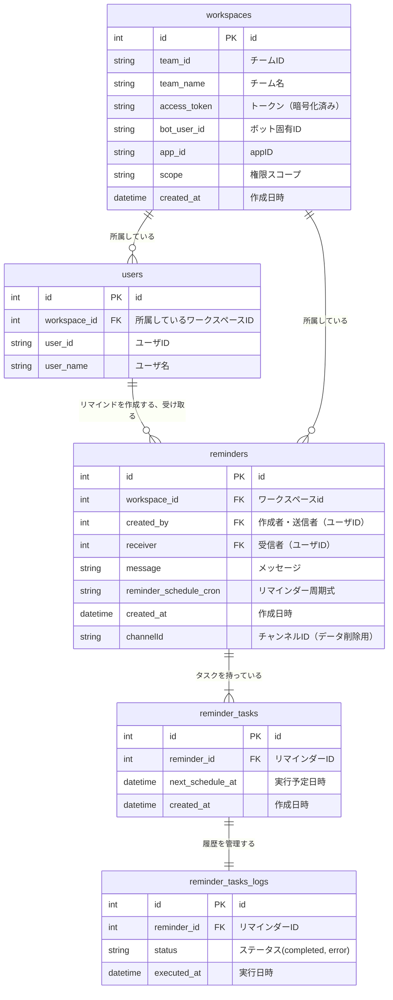

# 課題名

データベースモデリング4

# PRの目的

データベースモデリング4の以下作成しました。

- エンティティの抽出
- 論理設計
- 物理設計

# 仕様

課題の記述から

```
以下の機能を備えているものとします

- リマインダー
  - Slackに登録している他のユーザ（複数可）宛にリマインダーを設定できる
  - リマインダーには送信相手、文面、頻度を指定可能
  - 1時間ごとにバッチが動き、配信が必要なリマインダーを指定されたSlackユーザに配信する
- リマインダーの周期
  - 設定可能な周期は、現時点では以下の4種類（もしかすると今後増えるかもしれませんが、未定です！）
    - 毎日
    - X日おき
    - 毎週X曜日
    - 毎月X日
```

- OAuth認証時のレスポンスの情報を保存する際は、Botで運用するため、ユーザトークンは必要なさそう

# 結論

## エンティティの抽出

- Slack のチーム（ワークスペース）単位のトークンや情報
  以下保存しておく情報

```json
{
  "access_token": "xoxb-....",
  "bot_user_id": "U0KRQLJ9H",
  "app_id": "A0KRD7HC3",
  "team_id": "T9TK3CUKW",
  "team_name": "Slack Pickleball Team",
  "scope": "commands,incoming-webhook"
}
```

- ユーザ
  - ユーザID
  - 所属しているチームID（team_id）
  - ユーザ名
- リマインド
  - チームID
  - メッセージ
  - 作成者ID
  - 受信者ID
  - リマインダー周期式
  - 投稿日時
- リマインダータスク
  - リマインドid
  - ステータス
  - 次回送信日時（クーロン式から毎回計算するオーバーヘッドをなくすため）
  - 作成日時

## ER図



## 考えたこと

- バッチの実行時間を短くすることと、タスクの送信履歴・エラー管理ができるような設計を意識しました
- 実行フロー
  - ユーザが /penpen 実行時
    - （必要に応じて）`users` にユーザが挿入される
    - `reminders`にデータが挿入される
    - `remdinders_tasks` に次のスケジュールタスクが挿入される
  - バッチ実行時
    - reminder_tasks テーブルから`next_schedule_at <= now(現在時刻)` のタスクを検索し実行する
      - `reminder_tasks_logs` 実行履歴が挿入される
      - `reminder_tasks` テーブルから実行したタスクは削除される
      - `reminder_tasks` テーブルに次のスケジュールタスクが挿入される
- レコードの更新処理は発生しない
- リマインド完了時は `reminders`, またそれに紐づく`reminder_tasks`テーブルからレコード が削除される

## 懸念点

- リマインド先のメンション相手が @engineer みたいなチーム単位で作られているのが送られたときにユーザID単位で保存できるのか気になりました
