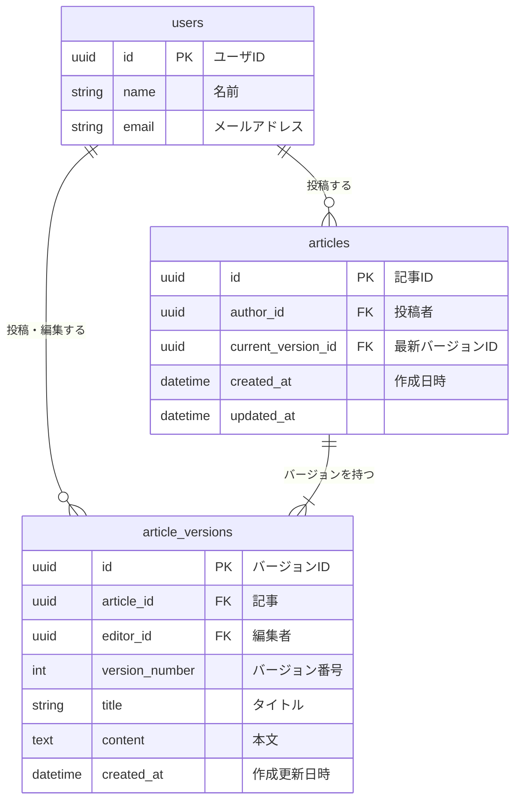

# 課題名

データベースモデリング5 課題１

# PRの目的

データベースモデリング5の課題１の回答です

# 課題（引用）

記事と、その編集履歴を保存できるサービス（ブログサービスのようなもの）のデータベースを設計して、UML図を作成してください。

以下の機能を備えているものとします。

- 記事
  - 1000文字程度の本文を記入して保存できる
- 記事の履歴
  - 記事を更新すると履歴が保存される
  - 特定の記事の履歴を一覧表示できる
  - 履歴を選択して過去の記事状態に戻す事が可能
- 記事の閲覧
  - 最新状態の記事を一覧表示できる

# 結論

## ER図

## 考えたこと

- `articles` テーブルの `current_version_id` は要件にあった最新記事一覧取得を、高速化（サブクエリなどを挟まない）のために置きました。
  - よって、 `articles` テーブルは `current_version_id` のみ更新が走ります。
  - `article_versions` は 挿入 のみになります
- 物理設計ではPostgreSQL とUUIDを採用してみました
