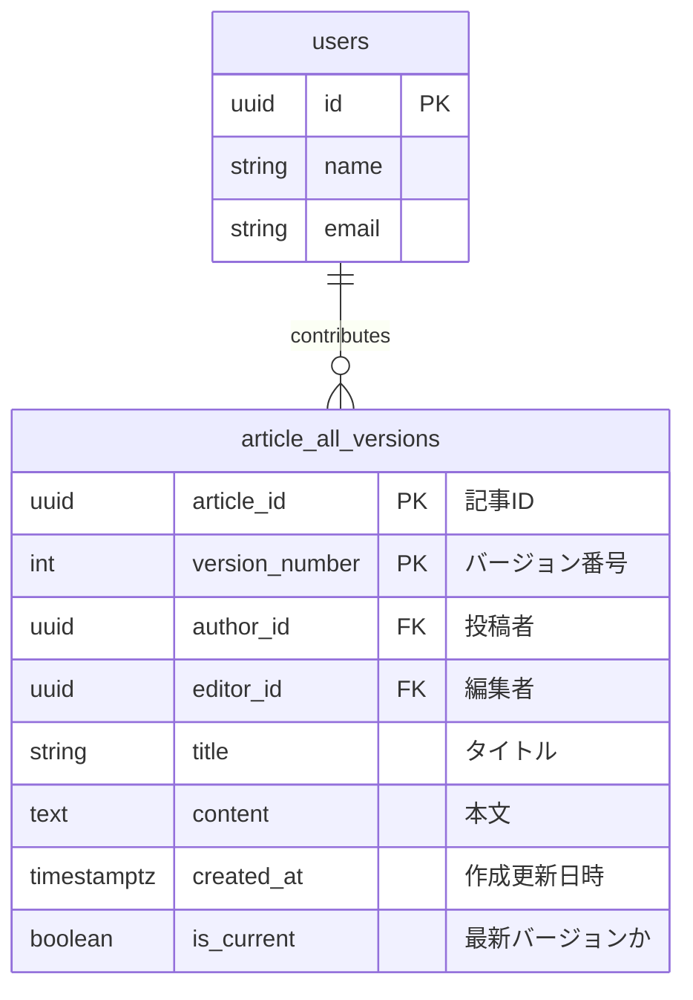

# 課題名

データベースモデリング5 課題2

# PRの目的

データベースモデリング5の課題2の回答です

# 課題（引用）

## 2-1

今回のようにアプリケーションに利用（履歴を一覧表示したり、履歴を復元）されるような履歴データはデータベースとして保存する必要がありますが、例えば「後から分析したいから履歴を残しておいて」など、分析のみの用途でも履歴データをデータベースに保存しておく必要はあるのでしょうか？ペアと話し合ってみてください。

## 2-2

履歴データの表現には様々な方法があります。
ご自身が[課題1](https://www.notion.so/36ac90c0037c4bbbbb9aeac53e9564b8?pvs=21)の回答で採用した設計とは異なるアプローチでもUML図を作成してみましょう。
どのようなメリット/デメリットがあるでしょうか？

# 結論

## 2-1の事前回答

分析のみの用途であれば、分析用のデータウェアハウスやログ基盤を用意して行うことは可能。特に、大量データを長期保存・多種多様に集計するならそちらのほうが良さそう。

## 2-2

## ER図

## 考えたこと

- 以前の設計の`articles` と `article_versions` を１つのテーブルにまとめる設計を行ってみました
- 最新判定は、 `is_current` フラグで直接検索できるようにしました
- メリット
  - JOIN 不要でクエリがシンプルになりそう
- デメリット
  - テーブルデータが肥大化するところ
  - 複合 PK のため扱いづらいかも
