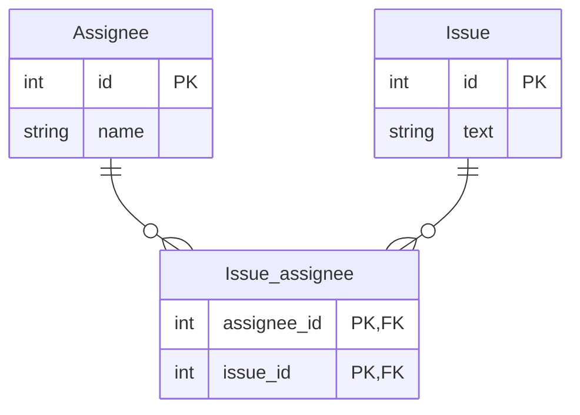

# 課題

データベースにおけるNULL
課題2

# 結論

テーブル作成

```mermaid
erDiagram

    Assignee {
        int id PK
        string name
    }

    Issue {
        int id PK
        string text
    }

    Issue_assignee {
        int assignee_id PK,FK
        int issue_id PK,FK
    }


    Assignee ||--o{ Issue_assignee : ""
    Issue ||--o{ Issue_assignee : ""
```

NULLがデータベースに存在することは本当に悪いことなのか？

- 3値になることの考慮漏れ等のリスクをまず考え、それらが許容できる場合に `null` とするべきか
  - 任意項目（ユーザの電話番号）などで `null` 自体に論理的な意味合いがある場合は許容する？

