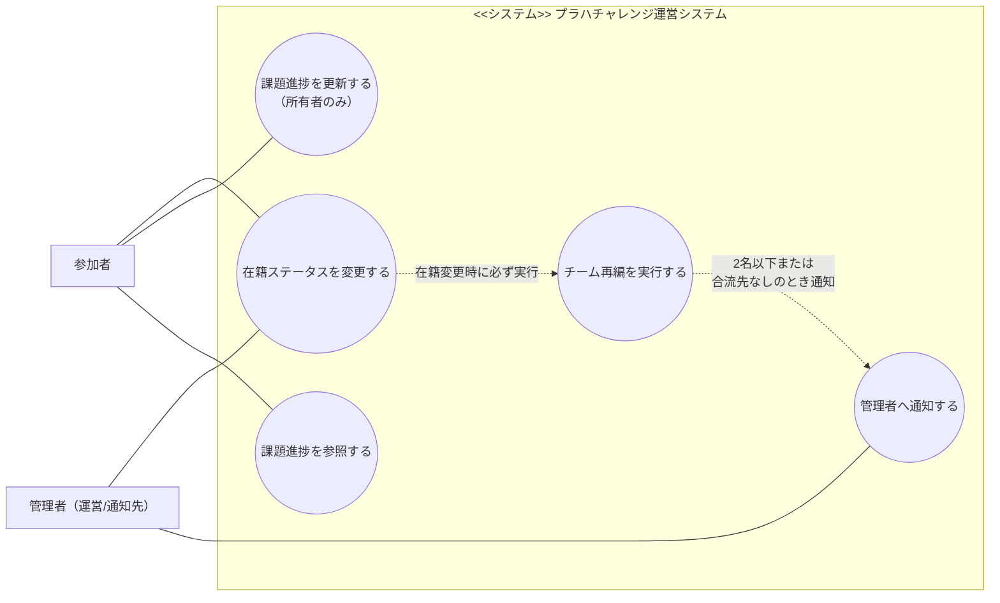
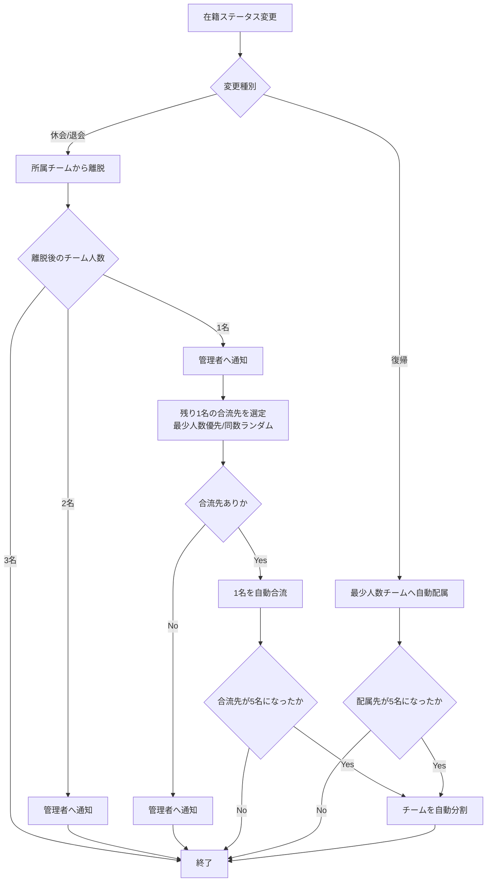
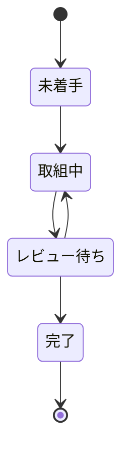
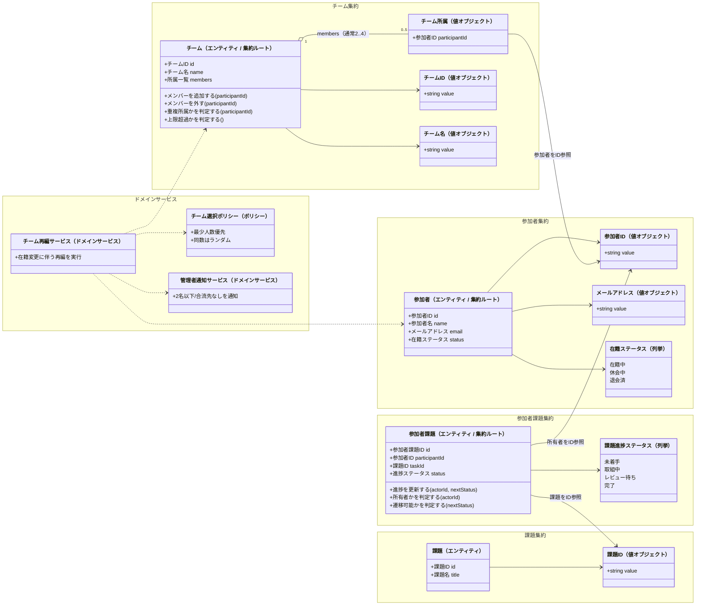

# DDD 特大課題1

## ユースケース図

## チーム再編のフローチャート

## 課題進捗の状態遷移図

## ドメインモデル図（集約境界つき）

## ドメインルール

| ルール | どこで守るか | 補足 |
|---|---|---|
| メールアドレス重複不可 | 登録/更新ユースケース + 参加者リポジトリ照会 | 最終防衛（一意制約など）は実装設計で決める |
| チーム名重複不可 | 登録/更新ユースケース + チームリポジトリ照会 | 最終防衛（一意制約など）は実装設計で決める |
| 在籍中以外はチーム所属不可 | 在籍ステータス変更処理 + チーム再編サービス | 集約横断ルール |
| チーム名形式、重複所属禁止、追加/削除 | `Team` のメソッド | 集約内ルール |
| 所有者のみ更新可、進捗ステータス遷移 | `ParticipantTask` のメソッド | 集約内ルール |
| 1名/5名チームの解消 | `TeamRebalanceService` | 2~4名の状態へ収束させる |
| 2名以下/合流先なしの通知 | `AdminNotificationService` | 管理者へ通知する |
