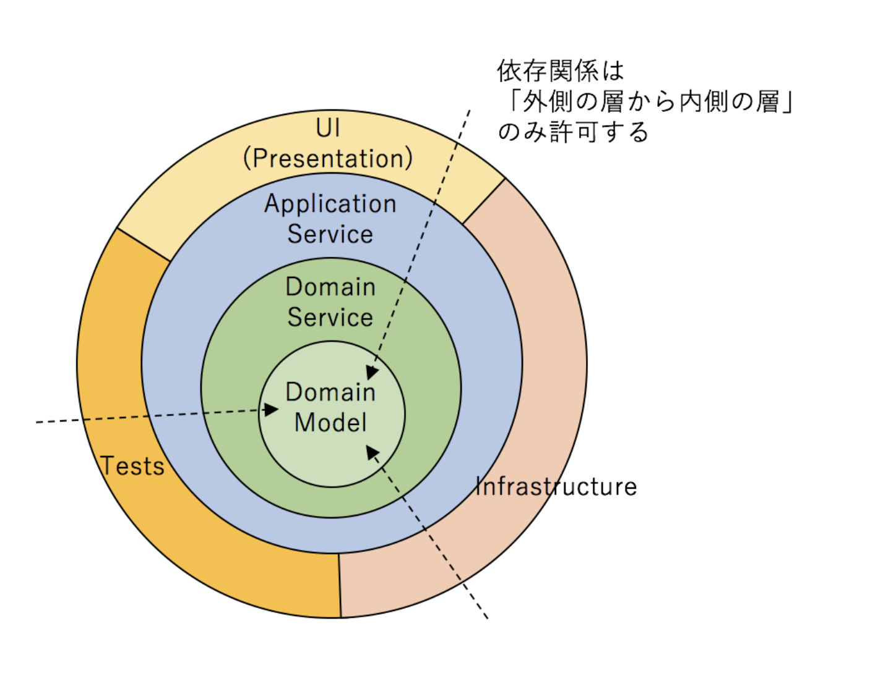

## 課題1-1

> オニオンアーキテクチャを図解してください。その際、以下の概念を必ず含めてください。 - ドメインモデル - ドメインサービス - インフラ - ユーザインターフェース

以下画像の通り

参照: <https://little-hands.hatenablog.com/entry/2017/10/11/075634>

## 課題1-2

> 中心に位置するドメインモデル層は他のどの層にも依存していません。こうすることに、どのようなメリットがあるのでしょうか？

- 変更に強い
  - DB、外部API、UIが変わっても、ビジネスルール（ドメインモデル）は影響を受けないため
- テストが書きやすい
  - DBなどと隔離されているため
- 凝集度が上がる
  - ビジネスルールがドメインに集約されているため

## 課題1-3

> 層をまたいで依存関係が発生する時（例えばユースケース層がレポジトリ層のメソッドを呼び出す時など）はインターフェースに対する依存のみ許可します。こうすることに、どのようなメリットがあるのでしょうか？

依存性逆転を実現し、具体実装に影響を受けなくなる。また、責務が分かれる

## 課題1-4

> 「依存性の逆転」がオニオンアーキテクチャにおいてどのように使われているのか説明してください

課題１-１の画像において、「内側が外側に依存する」関係をやめて、外側が内側のIFに合わせる方向に逆転させている

## 課題1-5

> 特定のユーザにしかリソースの追加や更新を許さないようなアクセス制限機能を実装したいとします。どの層に記述するのが適切でしょうか？（これは開発者によって意見が割れると思いますので、様々な観点から根拠を集めてみてください！）

- UI層（middleware等）
  - どのような時に使えそうか: ログイン必須などリクエスト単位で完結するシンプルな制限や、HTTP ヘッダ・トークンで判定できる場合
  - 利点: 早期に不正リクエストを遮断でき、アプリケーション/ドメイン層の負荷を下げられる。フレームワークの仕組みを活用できるため実装が軽い
  - 欠点: HTTP などに依存するためインターフェース追加時に重複実装が必要になる。ビジネスルールから切り離されることで要件との乖離が起こりやすい
- アプリケーション層
  - どのような時に使えそうか: 「このユースケースは特定ロールのみ実行可」のように、ユースケースに紐づいたアクセス制御を共通化したい場合
  - 利点: 各インターフェースが同じユースケースを共有しても統一した制御ができる。UI 層よりビジネス文脈に近いため要件変更を取り込みやすい
  - 欠点: ユースケースが権限制御で膨らみやすくなる。影響を局所化できるが、インターフェース追加時に再実装が必要
- ドメイン層
  - どのような時に使えそうか: 「このユーザ種別はそもそも更新できない」といった不変条件として扱いたいとき。どの UI/ユースケース経由でも必ず守られるべきビジネスルールの場合
  - 利点: ルールがドメインに内在化するため変更に強く、テストが容易。どの外部からの呼び出しでも抜け漏れなく適用できる
  - 欠点: ユースケース単位で細かな条件分岐などは表現できなくなる。認証結果やユーザ情報をドメインに渡すための設計が必要

## 課題1-6

> データベースをMySQLからPostgreSQLに変更するとします。どの層を変更する必要があるでしょうか？

インフラ層
